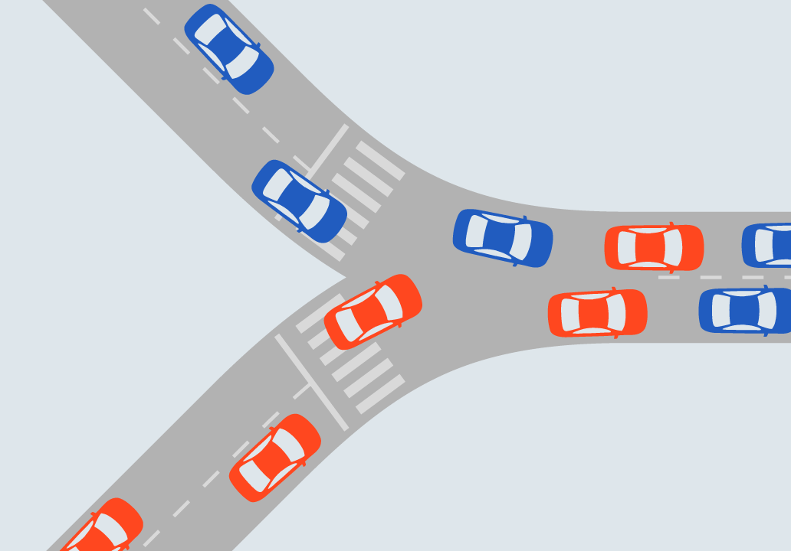
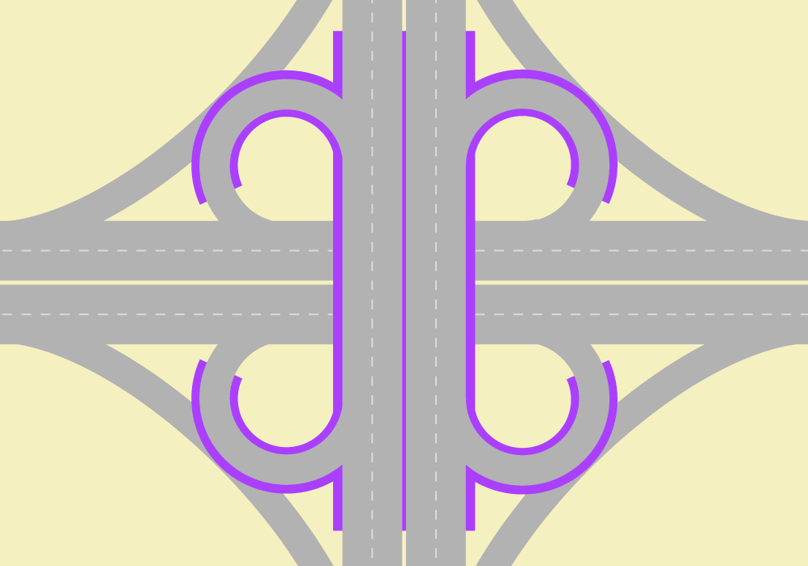
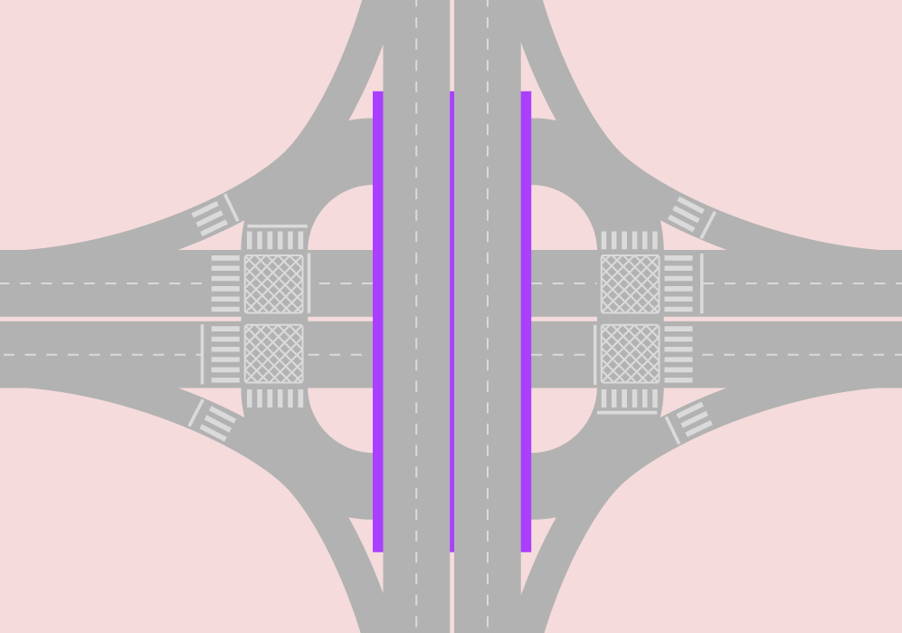

#[Intersections and traffic signals](toc.md#toc)

## Basic Concepts

**"Change means movement. Movement means friction. Only in the frictionless vacuum of a non-existent abstract world can movement or change occur without that abrasive friction of conflict."** - Saul Alinsky, political activist, 1909 – 1972

### About intersections

We are creating a forked version. 

Intersection is the area where two or more roads encounter each other. The use of the word in Traffic Engineering technical environment implies in "roads for vehicles" and "at the same level", but very often the expressions "at-grade intersections" or "single grade intersections" are used to confirm the concept; for fly-overs and underpasses the term used is "interchange" or still "separated-grade interchange". When more than one mode is involved, the common traffic engineers' wording is "crossing" as in  "pedestrian crossing" (one of the roads is assumed to be a carriageway); recently the term "multimodal intersection" has been applied.  

By this definition, intersection implies in conflicts for vehicles to use the same space, and can refer to an unidirectional T-shaped or Y-shaped confluence area; the conflicts there gets clear when there is no space to accommodate the two incoming flows on the exiting stream in a congested situation (figure \fignum(crowded-y-junction)). Conversely a channelled Y-shaped junction may not be an intersection (figure \fignum(channelled-y-junction)).

Considering the majority of cases of two or more roads meetings where there are many possible turning movements -- not all conflicting --, intersections can be seen as several adjacent intersections as well; i.e., an intersection is a larger conflict area that is composed of smaller conflict areas (=smaller intersections).

Once footpaths (or "roads for people") are more important to accessibility in populated areas, carriageways are usually constructed between footpaths. When two carriageways encounter, several walkways crossings are adjacent. So, a multimodal intersection encompasses a larger area where people conflict to use the same space. For clearance, let us remember that drivers and passengers are people.

The higher the number of conflicts in an intersection or in a crossing, higher is the time people will need to cross it safely.

If the frequency of vehicles arrivals at the intersection -- pedestrians and vehicles at a crossing -- is low, eventual passage negotiating is enough to maintain safety without compromising travel time.

If over the years the vehicle frequencies along the day rise to the point where queues happen often and last long or the time required to pedestrians to cross safely becomes too long is the moment to intervene.

An intervention is justified by the comparing the present value of costs for its implementation, maintenance and operation against the present value of its benefits, of which the most easier to establish are the time savings assuming a safe operation and the costs directly related to it (as fuel consumption and pollution).

Interventions start with zebras and yielding signs. Channelling the vehicles and creating refuge islands is a manner to clearly divide an intersection in several smaller intersection components, improving traffic safety and reducing the overall delay; roundabouts or mini-roundabouts are ways to channel vehicles as well. Above a certain point, traffic lights are required and they may grow in really complex ways to accommodate all conflicts; then traffic diversion and restricting direct movements come at play... until grade separation becomes necessary.

Ideally a separated-grade traffic solution eliminates intersections (figure \fignum(separated-grade-no-conflict)), but in practice, due to space restrictions, intersections eventually remain (figure \fignum(separated-grade-intersections-remain)).

### General Concepts

The concepts we present here are mostly related to understanding the equations related to delay and queues sizes in signalized intersections, without intention to be a complete reference about it. For basic concepts the reader may want to further investigate the concepts of traffic density and traffic headway, and how they relate with traffic average speed and traffic flow. We provide further references for traffic signals in the bibliography.

Before that, we emphasize that when applying formulas, attention should be given to units and units conversions; the appropriate dimension to perceive phase times in traffic lights or the time to walk or ride a few blocks is seconds while we better perceive speeds in kilometres or miles per hour. It is useful to remember that 1 hour is the same as 3600 seconds and one mile is approximately 1.6 kilometres and 1 kilometre is approximately 0.6 miles.

###### cross-traffic-turn and kerb-side-turn

For this chapter we have excluded the expressions right-turn and left-turn because they have different meanings in different hand-way systems. We have chosen to adopt cross-traffic and kerb-side-turn instead.

**cross-traffic-turn**: a vehicle movement to exit the current traffic stream direction that requires crossing the flow in the opposite way. If a busway or a bike lane is present near the median, there is also conflict with BRT vehicles or bicycles going straight in the same way as in opposite way.

**kerb-side-turn**: a vehicle movement to exit the current traffic stream direction that normally does not cross any vehicle flow. This movement conflicts with people on the side walk in both ways and if the road abridges curb-side busway or a curbside bike-lane, there is conflict with that traffic as well.

**u-turn**: a vehicle movement to join  the traffic stream in the opposite way of the direction of its current flow. Depending on the width of the median this movement can be less conflicting than the cross-traffic-turn or more conflicting as the speed has to be lower. For this reason, u-turns are sometime prohibited at existing intersections and promoted away from the intersection, creating another intersection exclusively for it. Due to road geometry restriction or other considerations, this movement eventually is channelized to start from a waiting area from the curb-side of the road, in which case it will conflict with both flows in the same way a cross-traffic-turn from a perpendicular street would.

, kerb-side-turn\(blue car\), u-turn without space \(red car\), u-turn with space \(pink car\) for right driving way as in China, US, Brazil and most of Europe. Image courtesy of Elebeta")

, kerb-side-turn\(blue car\), u-turn without space \(red car\), u-turn with space \(pink car\) for left driving way as in India, Indonesia, South-Africa, Tanzania, Australia and UK. Image courtesy of Elebeta")

###### Speed

For application with the concepts outlined in this chapter, speed, to which we use the letter V from the synonymous velocity, is the average traffic speed of all vehicles in a segment. It would be measured by the mean time of all vehicles crossing the segment divided by the segment extension. Under our modelling intents (that is capacity evaluation) it can be imagined that all vehicles are moving in that speed.

Still matching the broader concept of speed -- the ratio of motion expressed in distance per unit of time -- it is useful to remember that given a segment length (\(D_{segment}\), for distance), knowing the speed (\(V_{segment}\)) is equivalent of knowing the travel time (\(T_{segment}\)) through the segment and vice-versa, as the equivalent equations show:

\[ { V_{segment} = {D_{segment}} \over {T_{segment}} } \Rightarrow { T_{segment} = {D_{segment}} \over {V_{segment}} } \]

